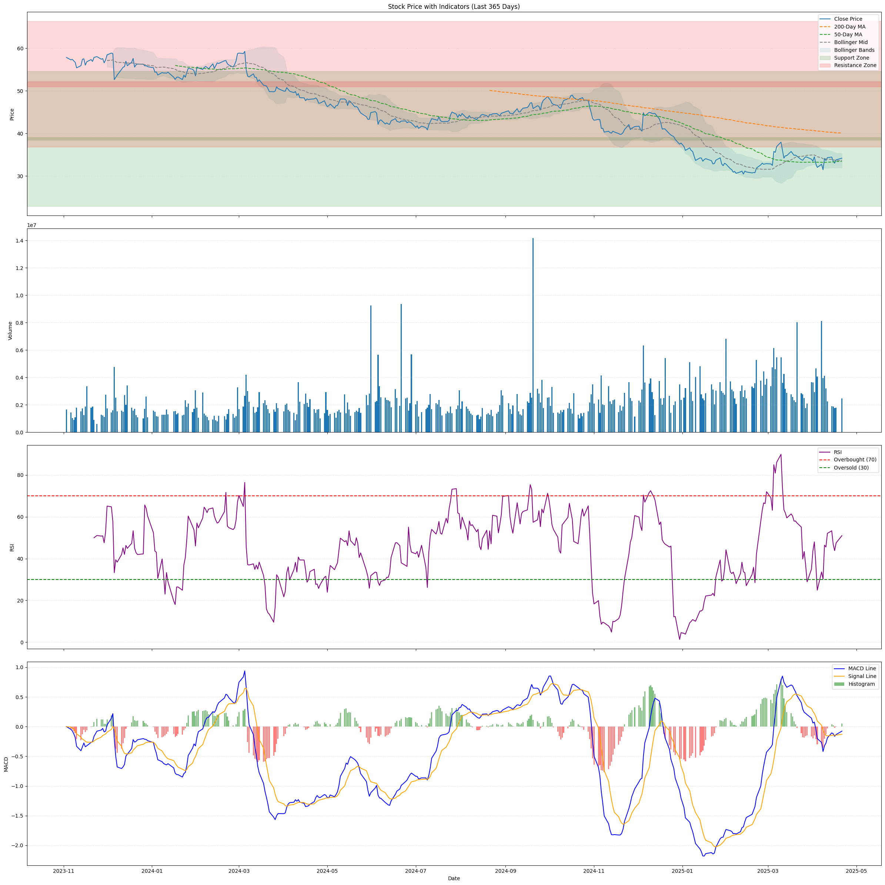
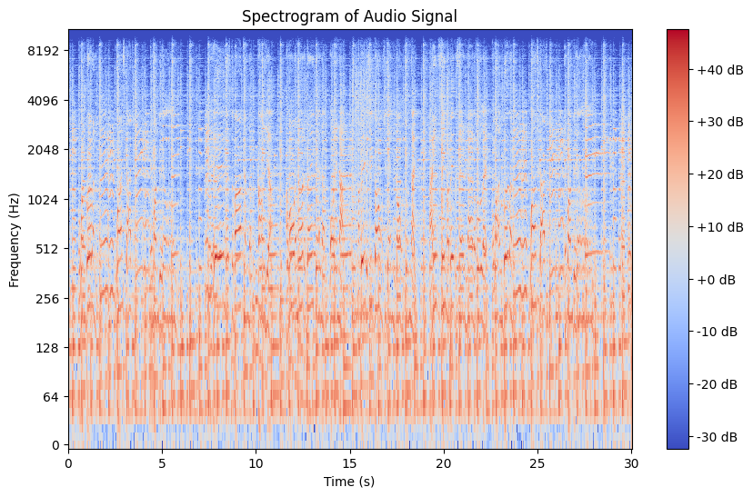
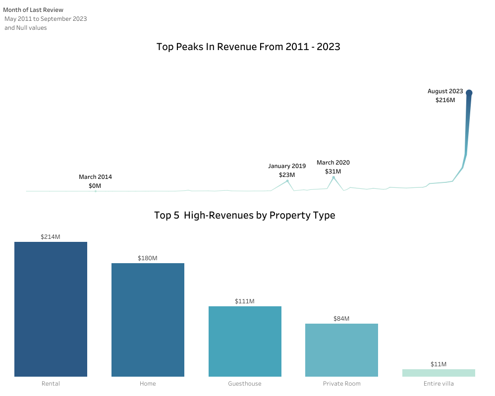
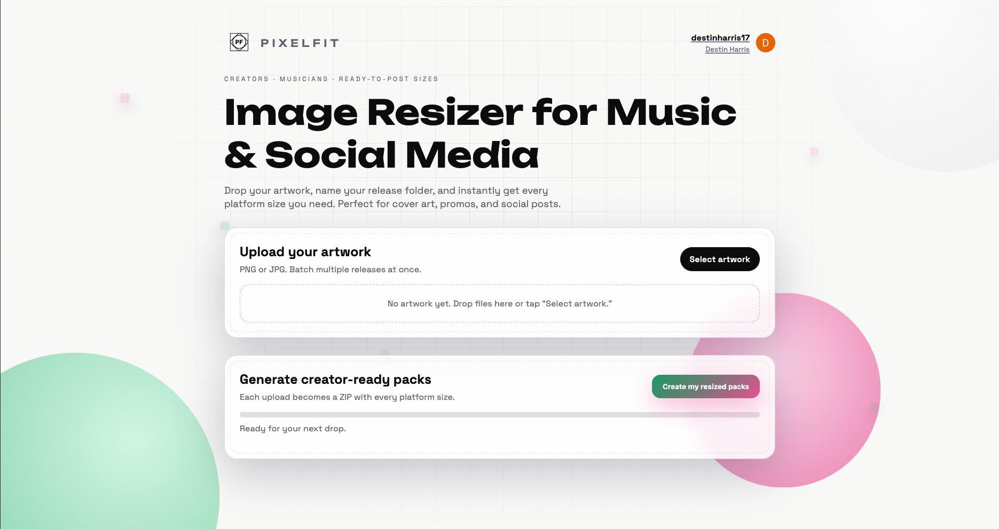

# Data Scientist

#### Technical Skills: Python, SQL, R, Tableau, MS Excel

## Education			        		
B.S., Business Analytics | The University of San Francisco (_December 2024_)

## Work Experience

**Project Administrator @ Beatty's Services, Inc. (_Febuary 2024 - Febuary 2025_)**
- Utilized advanced Excel functions to analyze and evaluate budget data, enabling informed decision-making and financial planning.
- Leveraged advanced research methods to identify and track contract data, resulting in a 15% boost in client engagement through strategic analysis.
- Served as the primary liaison between senior management and clients, facilitating effective communication and ensuring alignment with business objectives.
  
**Executive Team Lead @ Target (_June 2023 - August 2023_)**
- Managed and tracked product data, achieving a 3% reduction in INF (Items Not Found) through improving data accuracy &
inventory monitoring
- Conducted training sessions for over 100 team members, enhancing their skills & contributing to the overall team performance
- Initiated a new sales strategy to improve customer retention rates that boosted monthly reward sales by 5%.

## Projects
### Stock Market Analysis Using LTSM
[Market Analysis](https://colab.research.google.com/drive/1G4I9xmU1fPAnMgO6YJPcSiLRY2EK34nK?usp=sharing)

Developed and trained an LSTM model using A/B testing on historical stock price data, effectively capturing temporal trends and seasonality to generate accurate forecasts. Preprocessed data through normalization and sequence generation for time-series training, achieving a 7-day prediction accuracy of 80%. Enhanced forecasting precision by integrating financial insights from balance sheets, income statements, and earnings reports, applying statistical analysis to uncover patterns that informed more strategic, data-driven investment decisions.

### Audio Classification Using ML Classification
[Audio Classification](https://colab.research.google.com/drive/1ybI829q9ypgxR1D--fforarXbvOq4qmm?usp=sharing)

Analyzed audio frequencies using advanced Python libraries such as Librosa to improve the accuracy of forecasted audio patterns. Automated the data export workflow by developing a custom Python function to convert CSV files into JSON format, enhancing efficiency and accessibility for downstream processes. Cleansed and preprocessed over 2,000 rows of audio data, leveraging spectrogram analysis to extract signal shape insights—resulting in a 25% reduction in data processing time and significantly improved audio clarity.

### Palapas Student Analysis Using Google Looker
[Student Analysis](https://lookerstudio.google.com/reporting/29a4ad75-cf67-4d34-9592-c0a2952e0312)

Developed a dynamic, automated dashboard using Google Looker, featuring 8 detailed visualizations that uncovered key market trends and revealed previously unnoticed customer segments. Leveraged Python to analyze 1,000 rows of student data, successfully identifying four distinct grade levels and formulating two targeted tracking strategies to improve academic performance. Designed and implemented 5 custom KPIs to monitor student progression, providing actionable insights on patterns such as tardiness, grade distribution, and engagement levels.

[Palapas School Presentation](https://docs.google.com/presentation/d/1YZ1_IkfqzgOHQtMLlAd_humB4RueC14uqa_V7W2nGIE/edit?usp=sharing)

### LA AirBNB Analysis Using Tableau
[LA AIRBNB Analysis](https://lookerstudio.google.com/reporting/29a4ad75-cf67-4d34-9592-c0a2952e0312)

Created a dynamic, automated dashboard using Tableau to analyze Los Angeles Airbnb market trends, resulting in 8 key visualizations that identified top-performing neighborhoods and previously overlooked high-revenue zones. Analyzed over 1,000 Airbnb listings using Python to cluster geographic regions and distinguish four distinct market segments, enabling the development of two unique revenue optimization strategies. Designed 5 KPIs to track performance, including average nightly rate, occupancy rate, total revenue, listing density, and revenue per listing, driving actionable insights for market positioning and investment opportunities.

### Image Resizer Website using HTML,CSS,JS, and Python
[PixelArt Image Resizer](https://image-resizer-dusky.vercel.app/))

Built PixelFit, a full-stack automation platform that generates 5+ platform-specific image formats from a single upload, reducing manual content prep time by an estimated 70%. Developed a FastAPI backend with Google OAuth authentication, session management, and dynamic ZIP delivery, and deployed the system to production on Render. Architected and debugged a same-origin deployment model to resolve cross-domain authentication issues, enabling reliable user profile creation and session persistence.

## Interest

Entrepreneurship, LinkedIn Learning, Skating, Audio Engineering, Learning Languages (currently learning Chinese Mandarin)

## Contact Information

**Address:**  
San Francisco, California  

**Phone:**  
773-294-1375  

**Email:**  
Destinharris17@gmail.com  

**LinkedIn Profile:**  
[linkedin.com/in/destinharris](https://www.linkedin.com/in/destinharris/)
